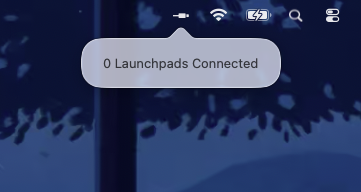
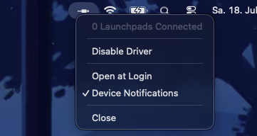

# NOVLPD01-MAC: Unofficial Launchpad Mk1 Driver for macOS

A lightweight, native macOS menu bar utility that brings Apple Silicon compatibility to the legendary 2009 **Novation Launchpad Mk1**.

> [!NOTE]
> This is a community-driven, open-source driver. I am **not** affiliated with Novation, and this is purely a passion project to keep classic hardware alive.

---

## Overview

The original Launchpad Mk1 (2009) is not a USB-MIDI class-compliant device. It relies on a proprietary USB protocol and Novation's official USB driver. Because Novation discontinued driver updates for newer macOS versions, the Launchpad Mk1 does not work out-of-the-box on modern macOS releases—especially on **Apple Silicon** (M1/M2/M3/M4) Macs.

**NOVLPD01-MAC** solves this by establishing a direct USB connection to the Launchpad Mk1 and translating its proprietary messaging into a standard, class-compliant CoreMIDI virtual port pair. This allows your Launchpad to work flawlessly in any modern DAW (like Ableton Live, Logic Pro, FL Studio, or Reaper).

## Showcase

Here is how the application interface looks in your macOS menu bar:

<p align="center">
  
  &nbsp;&nbsp;&nbsp;&nbsp;&nbsp;&nbsp;
  
</p>

* **Left-click** the menu bar icon to see the quick status popover showing the number of connected Launchpads.
* **Right-click** (or Control-click) the icon to open the options menu, where you can toggle the driver, configure startup preferences, toggle system notifications, or quit the app.

## Key Features

- Automatically detects when a Launchpad Mk1 is plugged in or unplugged.
- Converts USB packets to standard virtual MIDI messages and back.
- Connect multiple Launchpads simultaneously.
- Optional system notifications when a device is connected or disconnected.
- Option to automatically launch the driver when you log into your Mac.
- Sits silently in the macOS menu bar, consuming minimal system resources.

## Installation & Setup

1. **Build from Source** (see below) or download the prebuilt application.
2. Drag the app into your `/Applications` folder and open it.
3. The driver icon (`cable.connector.horizontal`) will appear in your status bar.
4. Plug in your Launchpad Mk1. You should receive a macOS notification indicating that the Launchpad is ready.
5. Launch your preferred DAW (e.g., Ableton Live).
6. In your DAW's MIDI settings, you will see `Launchpad Mk1` listed as an input and output port. Enable Track and Remote as needed.

## Technical Details

- **USB Interface**: Communicates directly with the Launchpad Mk1 hardware over USB (`Vendor ID: 0x1235`, `Product ID: 0x000E`) using Apple's standard USB communication libraries.
- **CoreMIDI Port Creation**: Leverages the official macOS `CoreMIDI` framework to expose standard virtual MIDI source and destination ports.
- **Message Tokenization**: Features a robust custom byte-stream tokenizer and running status encoder to ensure high-performance, error-free MIDI packet delivery.

## How to Build

1. Clone this repository to your local machine:
   ```bash
   git clone https://github.com/anthonyhfm/NOVLPD01-MAC.git
   cd NOVLPD01-MAC
   ```
2. Open `NOVLPD01-MAC.xcodeproj` using Xcode (version 15.0 or later is recommended).
3. Select the `NOVLPD01-MAC` scheme.
4. Build the project using `Product > Build` (or `Cmd + B`), or run it directly using `Product > Run` (or `Cmd + R`).
5. To export a standalone app, select `Product > Archive` and distribute the App.

## License & Disclaimer

This project is open-source and distributed under the MIT License. Novation is a registered trademark of Focusrite Audio Engineering Limited. This project is not officially supported, endorsed, or affiliated with them.